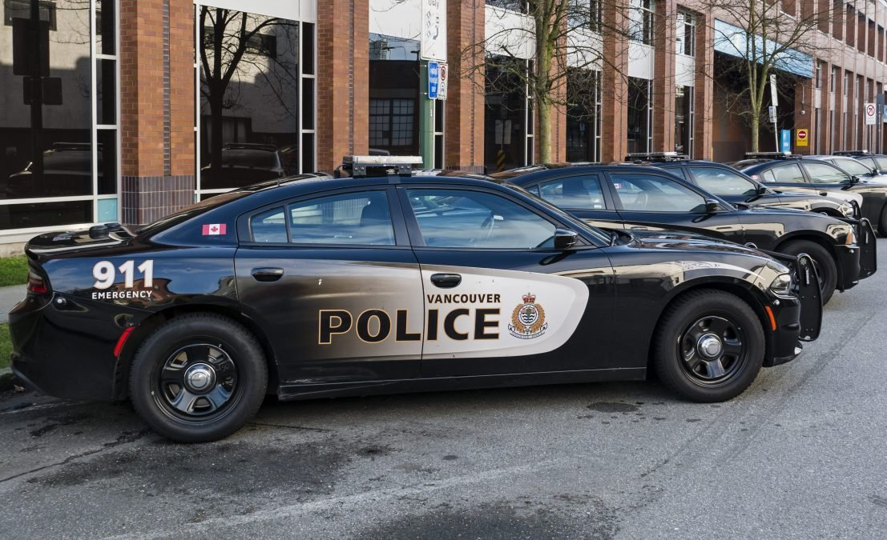

# Examining the Impact of COVID-19 on the Proportion of Theft in Metro Vancover

## Checklist

- [ ] Proposal is within 500 words
- [x] Proposal identifies data set
- [x] Proposal identifies research question
- [ ] Both an HTML file and .ipynb are submitted
- [x] Proposal includes: title, intro, preliminary results, methods, references
- [x] Introduction provides background to topic
- [x] Introduction clearly states research question
- [ ] Research question involves one random variable of interest
- [x] Research question is spread across 2+ categories
- [x] Location parameter identified
- [x] Scale parameter identified
- [x] Extra variables are dropped from data frame
- [x] Introduction describes data set
- [x] Question, objectives framed in terms of existing literature
- [x] Dataset read from web into R
- [x] Dataset is cleaned and wrangled
- [x] Plot the relevant raw data; tailored to research question
- [ ] Esimtates of parameter, across groups, identified; present in table, include in plot
- [x] Nothing is printed which takes up excess screen space
- [ ] Describe what ways our report is trustworthy
- [ ] Describe why plots and estimates are insufficient for stakeholder; what else is needed?
- [ ] Include hypothesis test, confidence interval (boostrapping, asymptotics)
- [ ] What do you expect find?
- [ ] What impact could such findings have?
- [ ] What future questions could this read to?
- [ ] 2+ citations of literature included

Group 4, Project Proposal (Acky Xu, Adam Mitha, Icy Xu, Michael DeMarco)

This project looks at the impact of the COVID-19 pandemic in Metro Vancouver, or specifically, the Strathcona neighbourhood. Novel inferential techniques are applied to estimate the proportion of theft crime to all crime between now and the mean proportion of the past 3 years. We conclude ...

## Introduction

In the past several months, multiple articles [links?] have discussed the issue of alleged increasing crime rates in Metro Vancouver. The economic contraction resulting to unprecendented job loss during the COVID-19 pandemic combined with fewer and more difficult-to-access resources (e.g., shelters, food banks) for those with unstable housing has driven increase in property-related crimes. In addition, hate crimes have more than doubled across the board, with those of East Asian descent being impacted most significantly, likely due to the origins of the COVID-19 virus.

These issues have led to a heightened concern in the general population about crime rates, which has caused significant tension between municipal governments and police departments with respect to funding cuts due to COVID-related drops in municipal revenue sources.

In light of these events, we are interested in exploring how much, if at all, crime rates have increased in over the last year. We will be using the Vancouver Police Department's open crime data to compare 2017-2020 crime rates in neighbourhoods across the income spectrum to assess just how much crime rates have changed over the past year.

2020 had impacted the lively hood of those that were fortunate and those that were already homeless.  In desperate times, Vancouver news outlet reported that crime hate has increased in Vancouver as people are trying to get their basic necessities met.

In our project, we are interested in exploring the question: has crime rate in actually increase in Vancouver by a significant amount in 2020, as reported by the new outlets?

## Preliminary Results

## Methods: Plan

We will retrieve Vancouver Police Force's crime data from the link below:
http://geodash.vpd.ca/opendata/crimedata_download/crimedata_csv_all_years.zip?disclaimer=on&x=101&y=21

Inside the zip file, there is a CSV file call 'crimedata_csv_all_years.csv' with the following headers:

- YEAR
- MONTH
- DAY
- HOUR
- MINUTE
- HUNDRED_BLOCK
- NEIGHBOURHOOD
- X
- Y

To narrow the scope of our project, we will focus on these neighbourhoods and run individual analysis on the crime rate of those neighbourhood:

- Strathcona
- Shaughnessy
- Marpole
- (Try to get a good spread of wealth of neighbourhood, since VPD bases their subdivision according to Stats Canada Census Division, we can use that to base our focus neighbourhoods)

Since we have the population of all crime reported in Vancouver, we will create a sampling distribution for 2020 and combination of 2019, 2018, and 2017(maybe? see if we need to do bootstrap.  If so, we can draw a sampel form the data set of the neighbourhood we are interested in and go form there).

Using our distribution, we will find the proportion of theft-related crime in 2017-2019 to use as our null hypothesis of what the crime rate in 2020 should be.

Then we will run our analysis to see if there is a significant change in crime rate in 2020 (either increase or decrease) for our hypothesis testing.

## Reflection

In our final report, we expect to find [...]

We anticipate the impact of our findings will be [...]

Three examples of further questions that could extend this analysis are:

1. item 1
2. item 2
3. item 3

## References

Existing literature exists for organized crime

Wikipedia

https://en.wikipedia.org/wiki/Impact_of_the_COVID-19_pandemic_on_crime#cite_note-32

Organized crime up

https://globalinitiative.net/wp-content/uploads/2020/03/GI-TOC-Crime-and-Contagion-The-impact-of-a-pandemic-on-organized-crime.pdf

Murder rates down

https://www.nytimes.com/2020/04/11/world/americas/coronavirus-murder-latin-america-crime.html

https://www.ncbi.nlm.nih.gov/pmc/articles/PMC7338127/

https://www.cbc.ca/news/canada/british-columbia/crime-statistics-vancouver-2020-1.5779400

https://www.osac.gov/Country/Canada/Content/Detail/Report/fd184899-ac3b-4e43-a31b-18f82fda35c4

https://bc.ctvnews.ca/hate-crimes-up-97-overall-in-vancouver-last-year-anti-asian-hate-crimes-up-717-1.5314307

https://www.cbc.ca/news/canada/british-columbia/city-of-vancouver-freezes-police-department-funding-as-part-of-2021-budget-1.5833731